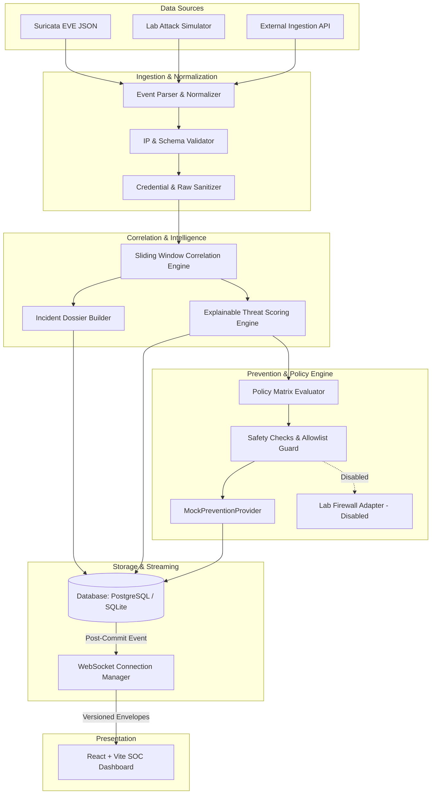

# System Architecture & Design Specification

## 1. High-Level Architecture Overview

AEGIS-IDPS is architected around a reactive, multi-tier security telemetry pipeline designed for high-throughput network monitoring and automated, auditable threat mitigation.



---

## 2. Ingestion & Normalization Layer

Network security devices, particularly Suricata, produce extensive telemetry lines via the EVE JSON format. The ingestion layer normalizes divergent event structures:
- **Alert Events**: Contain signature metadata, categorization, Suricata severity (1–4), source/dest IPs, and ports.
- **Protocol Telemetry (HTTP, DNS, TLS, Flow)**: Captured for context correlation and protocol anomaly detection.
- **Normalization Standard**: All inbound payloads are transformed into a normalized `SecurityEvent` model featuring standardized timestamps, numeric ports, normalized IP addresses, protocol classification, and an explicit `is_simulation` boolean flag.
- **Sanitization Guard**: Raw payload fields and headers containing password hashes, basic auth strings, or private cookies are sanitized before persistence.

---

## 3. Real-Time Correlation Engine

Rather than inundating SOC analysts with disconnected alert storms, the correlation engine aggregates related security events:
- **Correlation Keys**: Aggregates by `source_ip` and `category` (e.g., `198.51.100.42` + `attempted-admin`).
- **Sliding Time Window**: Default window of **300 seconds (5 minutes)**. Events originating from the same source IP under the same threat classification within this window attach to an existing `Incident` dossier rather than spawning duplicate tickets.
- **Dossier Enrichment**: Updates `event_count`, `last_seen`, target IP diversity, and triggers a recalculated threat assessment.

---

## 4. Deterministic Threat Scoring Engine

Unlike opaque "black-box" machine learning systems, AEGIS-IDPS computes explainable, mathematically verifiable scores from 0 to 100.

### Scoring Factors:
1. **Base Category & Signature Weight (up to 40 pts)**:
   - Remote Command Execution / Exploit: 40 pts
   - SQL Injection / Authentication Bypass: 35 pts
   - Credential Brute Force: 25 pts
   - Reconnaissance / Port Scanning: 15 pts
   - Telemetry / Benign: 5 pts
2. **Event Burst Frequency (up to 25 pts)**:
   - Evaluates the rate of arrival within the correlation window. 10+ rapid events add 25 pts.
3. **Target Port Sensitivity (up to 20 pts)**:
   - Attacks targeted at critical infrastructure ports (SSH: 22, Database: 3306/5432, Directory: 389/636, Web: 80/443, SMB: 445) receive elevated sensitivity points.
4. **Target Breadth / Subnet Lateral Movement (up to 15 pts)**:
   - Source IP contacting multiple internal endpoints receives anomalous distribution points.

### Severity Tiers:
- **LOW (0–29)**: Telemetry logged for audit trail.
- **MEDIUM (30–59)**: Suspicious activity logged; analyst triage recommended.
- **HIGH (60–79)**: High-priority security incident; analyst alert dispatched.
- **CRITICAL (80–100)**: Hostile attack; eligible for automated mock prevention.

---

## 5. Safe Prevention Engine & Provider Architecture

The prevention engine enforces multi-tier response policies without putting host operating system connectivity at risk.

### Pluggable Provider Interface
```python
class BasePreventionProvider(ABC):
    @abstractmethod
    def block_source(self, target: str, reason: str, duration_minutes: Optional[int], is_simulation: bool) -> PreventionResult:
        pass

    @abstractmethod
    def unblock_source(self, target: str, reason: str, is_simulation: bool) -> PreventionResult:
        pass

    @abstractmethod
    def health_check(self) -> Dict[str, Any]:
        pass
```

### Safety Rules Enforced Before Execution:
1. **Global Engine State**: Evaluated against system settings; inactive engine cancels execution.
2. **Simulation Safety Exclusion**: Simulated events (`is_simulation: true`) are unconditionally rejected from triggering automated prevention.
3. **Allowlist Exemption**: Known internal infrastructure, DNS servers, and trusted monitoring nodes bypass blocks and log an auditable `WHITELIST_BYPASS` action.
4. **Duplicate Block Prevention**: A target with an existing active block lease cannot receive redundant concurrent blocks.
5. **IP Format Verification**: Strict `ipaddress` parsing prevents invalid or malformed target strings.
6. **Failed Execution Transparency**: If a provider fails or encounters a timeout, the action is recorded as `FAILED`, and the target IP is never marked as an active block.

---

## 6. Real-Time WebSockets & Asynchronous Streaming

AEGIS-IDPS implements a dedicated `ConnectionManager` for real-time telemetry streaming:
- **In-Frame Handshake Authentication**: WebSockets authenticate via an initial JSON handshake message (`{"type": "authenticate", "token": "..."}`). Long-lived bearer tokens are never exposed in URL query parameters.
- **Bounded Client Queues**: Each connected client has an isolated `asyncio.Queue(maxsize=100)`. Slow browser clients dropping packets do not block fast clients or backend ingestion.
- **Post-Commit Dispatch**: Event broadcasting is triggered strictly *after* database transactions commit via `broadcast_event_sync`, ensuring database integrity even if network transport fails.
