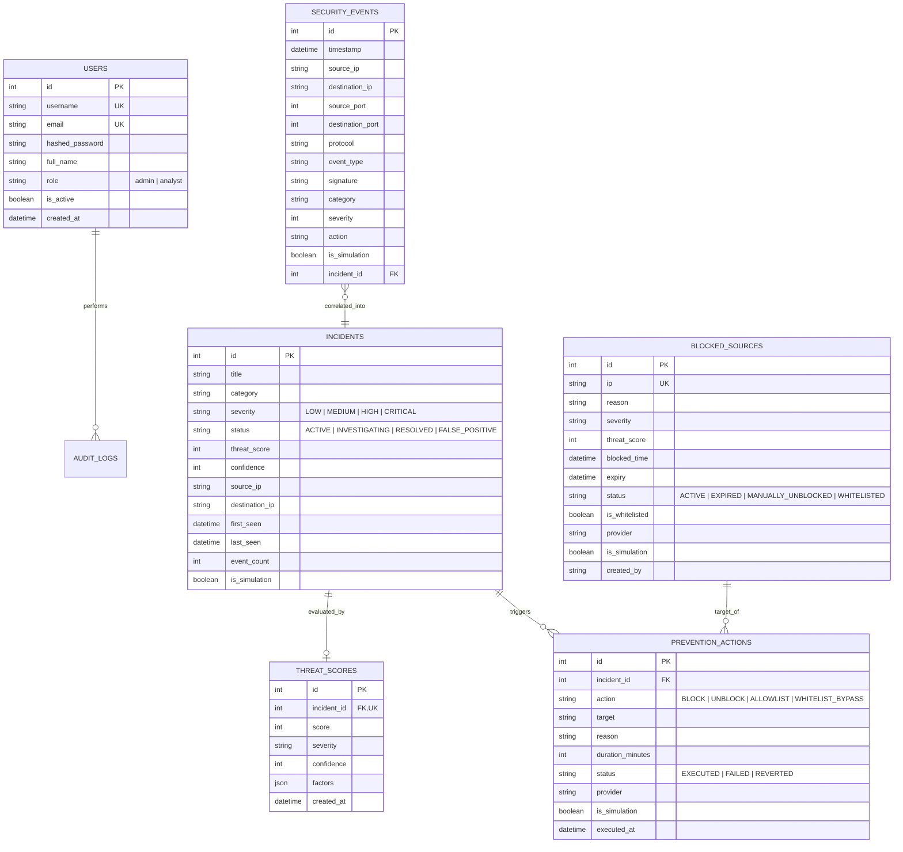

# Database Architecture & Migration Specification

## 1. Relational Entity-Relationship Model

AEGIS-IDPS leverages an enterprise relational schema supported across both SQLite (for local lab environments) and PostgreSQL (for production clustering).

---

## 2. Table Specifications & Indexes

### `security_events`
- Primary table capturing normalized raw alerts and protocol telemetry.
- **Indexes**:
  - `ix_security_events_source_ip` (`source_ip`): Fast lookups for correlation.
  - `ix_security_events_timestamp` (`timestamp`): Sliding window filtering.
  - `ix_security_events_incident_id` (`incident_id`): Rapid dossier joining.

### `incidents`
- High-level security incident dossiers aggregated by the correlation engine.
- **Indexes**:
  - `ix_incidents_source_ip` (`source_ip`)
  - `ix_incidents_status` (`status`)
  - `ix_incidents_severity` (`severity`)
  - `ix_incidents_last_seen` (`last_seen`)

### `blocked_sources`
- Tracks IP block leases, expiry timestamps, and permanent allowlist entries.
- **Unique Constraint**: `uq_blocked_sources_ip` (`ip`)
- **Indexes**: `ix_blocked_sources_status`, `ix_blocked_sources_expiry`

### `prevention_actions`
- Immutable audit ledger recording every automated and manual prevention decision.
- **Indexes**: `ix_prevention_actions_target`, `ix_prevention_actions_executed_at`

---

## 3. Alembic Migration History

Schema evolution is tracked using Alembic migrations:

| Revision ID | Description | Key Changes |
|---|---|---|
| `e14a8219c670` | Initial baseline | Created `users`, `security_events`, `detection_rules`, `system_settings`, `audit_logs` |
| `a793c21b93f2` | Incidents & Scoring | Created `incidents`, `threat_scores`; added `incident_id` foreign key on `security_events` |
| `d449e463c746` (head) | Safe Prevention & Blocking | Created `blocked_sources`, `prevention_actions`; added `is_simulation` columns |
